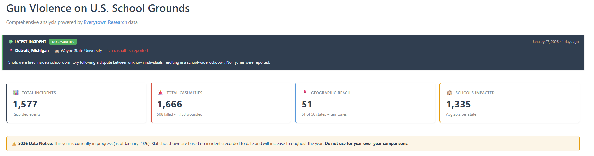
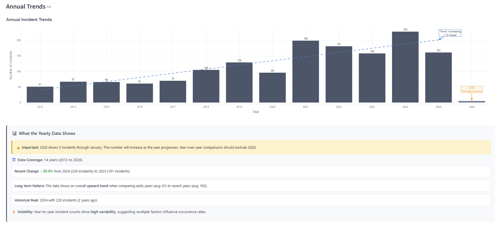
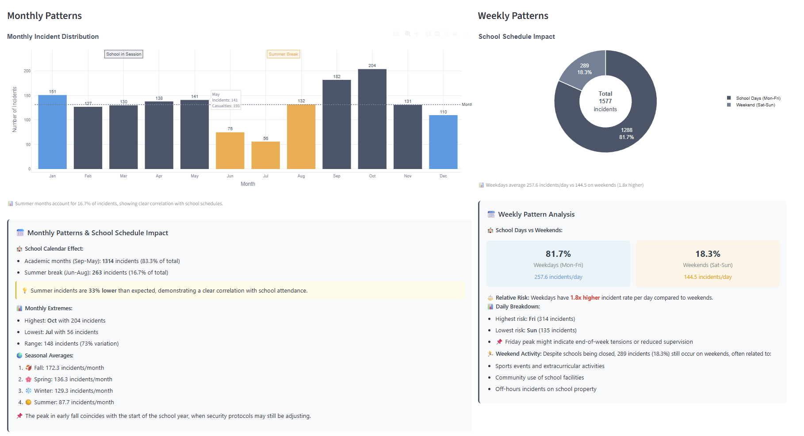
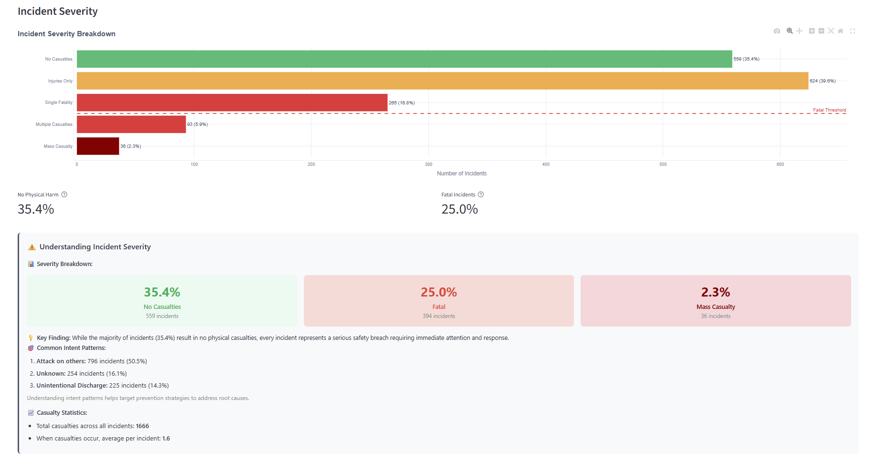
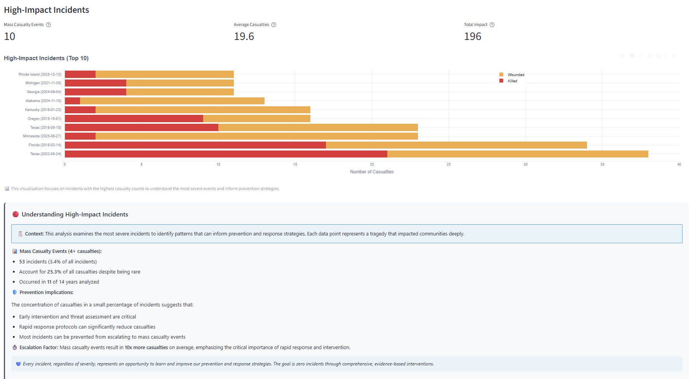
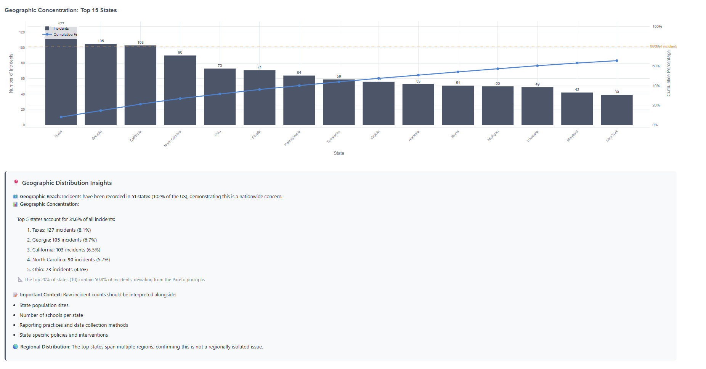

# 🎓 Gun Violence on U.S. School Grounds  
**A Comprehensive Analytics & Decision Support Dashboard**

[](https://gunfire-school.streamlit.app/)


---

## 📌 Project Overview

Gun violence on school grounds is a complex public-safety challenge that requires **data-driven insight**, not isolated incident reports. Policymakers, researchers, and school administrators often lack a centralized way to identify **temporal trends, geographic concentration, and severity patterns** across the U.S.

This project delivers an **end-to-end analytics and decision-support solution** that transforms raw incident data into **actionable intelligence** through an interactive dashboard and an automated executive report.

---

## 🎯 Project Objectives

- Centralize and validate nationwide school gun-violence data  
- Identify **when**, **where**, and **how severe** incidents occur  
- Support **evidence-based policy and prevention strategies**  
- Demonstrate production-grade **data engineering and analytics skills**

---

## 📊 Analytics Capabilities

### 🔹 Temporal & Trend Analysis
- Year-over-year incident trends (2013–2026)
- Monthly and weekly pattern detection
- Academic calendar correlation (school year vs. summer break)

### 🔹 Geographic Intelligence
- State-level concentration analysis
- City-level hotspot identification
- Cumulative distribution and Pareto-style insights

### 🔹 Severity & Impact Assessment
- Casualty-based severity classification
- Fatal vs. non-fatal incident analysis
- Mass-casualty event concentration

### 🔹 Executive Reporting
- Automated HTML executive report
- Data quality indicators (100% completeness)
- Policy-oriented findings and recommendations
- Professional CSS styling for stakeholder presentations

---

## 📸 Dashboard Screenshots

### 1️⃣ Executive Dashboard Overview


*High-level summary displaying total incidents, casualties, geographic reach, and schools impacted nationwide, along with the most recent reported incident.*

---

### 2️⃣ Annual Incident Trends


*Year-over-year analysis (2013–2026) highlighting long-term growth trends, recent volatility, and annotations cautioning against partial-year comparisons.*

---

### 3️⃣ Monthly & Weekly Patterns


*Temporal breakdown revealing strong alignment with the academic calendar, including reduced summer incidents and higher weekday risk during school sessions.*

---

### 4️⃣ Incident Severity Analysis


*Distribution of incidents by severity (no casualties, injuries, fatalities, and mass-casualty events), contextualized with intent patterns and overall human impact.*

---

### 5️⃣ High-Impact (Mass Casualty) Incidents


*Focused analysis of the most severe incidents, illustrating how a small number of events account for a disproportionate share of total casualties.*

---

### 6️⃣ Geographic Concentration by State


*State-level concentration analysis identifying top contributing states and cumulative incident share, emphasizing nationwide scope.*

---

## 📄 Executive Report (HTML)

📊 **[View Sample Executive Report](https://hasnem.github.io/Gunfire-school/sample_executive_report.html)**

The automated executive report is designed for **policy briefings and leadership review**, featuring:

- Executive summary with data quality validation  
- Long-term trend and volatility analysis  
- Geographic concentration metrics  
- Severity and mass-casualty assessment  
- Evidence-based prevention recommendations  
- Print-ready professional CSS layout  

---

## 🛠️ Data Pipeline & Architecture

### **Extract**
- Automated ingestion of public CSV data from **Everytown Research**
- Network and schema validation

### **Transform**
- Deduplication using composite keys (date + city + school)
- Geospatial validation for mapping accuracy
- Feature engineering:
  - School-year logic (Aug–July)
  - Time-since-last-incident metrics
  - Severity and intent classification

### **Load**
- Optimized in-memory caching for Streamlit
- Interactive visualization layer
- HTML report generation for offline and executive use

---

## 💻 Tech Stack

| Domain | Tools |
|------|------|
| Language | Python |
| Data Engineering | Pandas, NumPy |
| Visualization | Plotly, Folium |
| UI | Streamlit |
| Reporting | HTML, CSS |
| Analytics | Statistical trend & severity analysis |

---

## 🚀 Running the Project Locally

### Prerequisites
- Python 3.8+
- pip

### Setup
```bash
git clone https://github.com/yourusername/school-gun-violence-dashboard.git
cd school-gun-violence-dashboard

python -m venv venv
source venv/bin/activate  # Windows: venv\Scripts\activate
pip install -r requirements.txt
